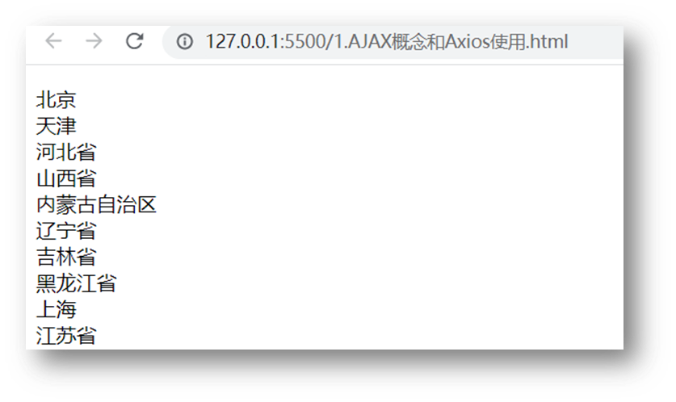
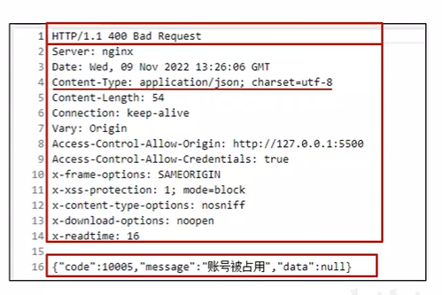

# Day01_Ajax入门

## 目录

* AJAX 概念和 axios 使用
* 认识 URL
* URL 查询参数
* 常用请求方法和数据提交
* HTTP协议-报文
* 接口文档
* 案例 - 用户登录
* form-serialize 插件

## 学习目标

1. 掌握 axios 相关参数，从服务器获取并解析展示数据
1. 掌握接口文档的查看和使用
1. 掌握在浏览器的 network 面板中查看请求和响应的内容
1. 了解请求和响应报文的组成部分

## 01.AJAX 概念和 axios 使用

1. 什么是 AJAX ? [mdn](https://developer.mozilla.org/zh-CN/docs/Web/Guide/AJAX/Getting_Started)

   * 使用浏览器的 **XMLHttpRequest 对象** 与**服务器**通信

   * 浏览器网页中，使用 AJAX技术（XHR对象）发起获取省份列表数据的请求，服务器代码响应准备好的省份列表数据给前端，前端拿到数据数组以后，展示到网页

     

2. 什么是服务器？

   * 可以暂时理解为**提供数据的一台电脑**

3. **为何学 AJAX ?**

   * **以前我们的数据都是写在代码里固定的, 无法随时变化**
   * **现在我们的数据可以从服务器上进行获取，让数据变活**

4. 怎么学 AJAX ?

   * 这里使用一个第三方库叫 axios, 后续在学习 **XMLHttpRequest 对象了解 AJAX 底层原理**
   * 因为 axios 库语法简单，让我们有更多精力关注在与服务器通信上，而且后续 Vue，React 学习中，也使用 axios 库与服务器通信

5. 需求：从服务器获取省份列表数据，展示到页面上（体验 axios 语法的使用）

   > 获取省份列表数据 - 目标资源地址：http://hmajax.itheima.net/api/province

   * 完成效果：

     

6. 接下来讲解 axios 语法，步骤：

  7. 引入 axios.js 文件到自己的网页中

     > axios.js文件链接: https://cdn.jsdelivr.net/npm/axios/dist/axios.min.js

     > 现在已经没法直接用这个链接了 我换了一个

  8. 明确axios函数的使用语法

     ```js
     axios({
       url: '目标资源地址'
     }).then((result) => {
       // 对服务器返回的数据做后续处理
     })
     ```

     > 注意：请求的 url 地址, 就是标记资源的网址
     >
     > 注意：then 方法这里先体验使用，由来后续会讲到

### 总结

1. AJAX 有什么用？

- 浏览器和服务器之间通信，动态数据交互

  > 在不刷新页面的情况下动态更新页面内容

2. AJAX 如何学：

- 先掌握 axios 使用

- 再了解 XMLHttpRequest 原理

3. 这一节 axios 体验步骤？

- 引入 axios 库

- 使用 axios 语法


## 02.认识 URL

1. 为什么要认识 URL ? [mdn](https://developer.mozilla.org/zh-CN/docs/Web/Guide/AJAX/Getting_Started)

   - 原因：知道作用和组成，方便与后端人员沟通

2. 什么是 URL ？

   * **统一资源定位符**，简称网址，用于定位网络中的资源（资源指的是：网页，图片，数据，视频，音频等等）

     

   例如：

   • https://www.baidu.com/index.html →网页资源

   • https://www.itheima.com/images/logo.png →图片资源

   • http://hmajax.itheima.net/api/province →数据资源

   • ...

   概念：URL 就是统一资源定位符，简称网址，用于访问网络上的资源

3. URL 的组成?

   * **协议，域名，资源路径（URL 组成有很多部分，我们先掌握这3个重要的部分即可）**

     

     

4. 什么是 http 协议 ?

   * 叫**超文本传输协议**，规定了**浏览器和服务器传递数据的格式**（而格式具体有哪些稍后我们就会学到）

     

5. 什么是域名 ?

   * 标记**服务器在互联网当中的方位**，**网络中有很多服务器，你想访问哪一台，就需要知道它的域名才可以**

     

6. 什么是资源路径 ?

   * 一个服务器内有多个资源，用于**标识你要访问的资源具体的位置**

     

7. 接下来做个需求，访问新闻列表的 URL 网址，打印新闻数据

   * 效果图如下：

   

   > 新闻列表数据 URL 网址：http://hmajax.itheima.net/api/news

   ```js
   axios({
     url: 'http://hmajax.itheima.net/api/news'
   }).then(result => {
     console.log(result)
   })
   ```

   > url解释：从黑马服务器使用http协议，访问/api/news路径下的新闻列表资源


### 总结

\1. URL 是什么：

➢ 统一资源定位符，网址，用于访问服务器上资源

\2. 请解释这个 URL，每个部分作用？

➢ http://hmajax.itheima.net/api/news

➢ 协议://域名/资源路径

## 03.URL 查询参数

1. 什么是查询参数 ?

   - 

   * 携带给服务器**额外信息**，让服务器返回我想要的**某一部分数据而不是全部数据**
   * 举例：查询河北省下属的城市列表，需要先把河北省传递给服务器

2. 查询参数的语法 ？

   ==（原始语法 写项目不这么用）==

   * 在 url 网址后面用?拼接格式：http://xxxx.com/xxx/xxx?**参数名1**=值1&**参数名2**=值2

   > 用？分隔符连接 后面都是查询参数 然后之间用&链接

   * **参数名一般是后端规定的**，值前端看情况传递即可
   * **查询名指的是后端规定的这个查询参数**

3. axios 如何携带查询参数?

   * 使用 **params 选项**即可

     ```js
     axios({
       url: '目标资源地址',
       params: {
         参数名: 值
       }
     }).then(result => {
       // 对服务器返回的数据做后续处理
     })
     ```
     
     > 查询城市列表的 url地址：[http://hmajax.itheima.net/api/city](http://hmajax.itheima.net/api/city?pname=河北省)
     >
     > 参数名：pname （值要携带省份名字）
     
     
     
     **⭐ 注意对应位置**

4. 

使用axios从url对应的服务器获取信息

使用查询参数进行筛选

==**(使用params选项 就不需要用?拼接了 axios内部源码是用的原始的拼接格式)**==


## 04.案例-查询-地区列表

### 讲解

1. 需求：根据输入的省份名字和城市名字，查询下属地区列表

   * 完成效果如下：

     

   * 相关参数

     > 查询地区: http://hmajax.itheima.net/api/area
     >
     > 参数名：
     >
     > pname：省份名字
     >
     > cname：城市名字
     
   * eg.点击 http://hmajax.itheima.net/api/area?pname=北京&cname=北京市

   * > 这个应该就是字符串所以不用打引号了

   

   

   

   参数名和变量名一样也可以 这样可以简写

   便于编辑

###  小结

1. ES6 对象属性和值简写的前提是什么？

   <details>
   <summary>答案</summary>
   <ul>
   <li>当属性名和value位置变量名同名即可简写
   </li>
   </ul>
   </details>


## 05.常用请求方法和数据提交

### 目标

掌握如何向服务器提交数据，而不单单是获取数据

### 讲解

1. 请求方法

   * 请求方法是一些固定单词的英文，例如：GET，POST，PUT，DELETE，PATCH（这些都是http协议规定的），每个单词对应一种对服务器资源要执行的操作

     

     

   * 前面我们获取数据其实用的就是GET请求方法，但是**axios内部设置了默认请求方法就是GET**，我们就没有写

   * 但是**提交数据需要使用POST请求方法**

2. 什么时候进行数据提交呢？

   - 场景：当数据**需要在服务器上保存**

   * 例如：多端要查看同一份订单数据，或者使用同一个账号进行登录，那订单/用户名+密码，就需要保存在服务器上，随时随地进行访问

3. axios 如何提交数据到服务器呢？

   url：请求的url网址

   method：请求的方法，GET可以省略（不区分大小写）

   data：提交数据

   ```js
   axios({
     url: '目标资源地址',
     method: '请求方法',
     data: {
       参数名: 值
     }
   }).then(result => {
     // 对服务器返回的数据做后续处理
   })
   ```

   

4. 需求：注册账号，提交用户名和密码到服务器保存

   > 注册用户 URL 网址：http://hmajax.itheima.net/api/register
   >
   > **// 这一次需要提交内容上去**
   >
   > 请求方法：POST
   >
   > 参数名：
   >
   > username：用户名（要求中英文和数字组成，最少8位）
   >
   > password：密码（最少6位）

   

5. 

控制台输出的是result

这个message是服务器给的相应

## 06.axios 错误处理

### 讲解

1. 如果注册相同的用户名，则会遇到注册失败的请求，也就是 axios 请求响应失败了，你会在控制台看到如图的错误：

   

   ==注意两个错误信息的不同==

2. 在 axios 语法中要如何处理呢？

   * 因为，普通用户不会去控制台里看错误信息，我们要**编写代码拿到错误并展示给用户在页面上**

3. 使用 **axios 的 catch 方法**，捕获这次请求响应的错误并做后续处理，语法如下：

   ==在then方法的后面，通过点语法调用catch方法，传入**回调函数**并定义形参==

   > - 异常名称是后端定义的
   > - 

   ```js
   axios({
     // ...请求选项
   }).then(result => {
     // 处理成功数据
   }).catch(error => {
     // 处理失败错误
   })
   ```

4. 需求：再次重复注册相同用户名，提示用户注册失败的原因

   

   

###  小结

1. axios 如何拿到请求响应失败的信息？

   <details>
   <summary>答案</summary>
   <ul>
   <li>通过 axios 函数调用后，在后面接着调用 .catch 方法捕获
   </li>
   </ul>
   </details>

## 07.HTTP 协议-请求报文

1. 首先，HTTP 协议规定了浏览器和服务器返回内容的<span style="color: red;">格式</span>

2. 请求报文：浏览器**按照HTTP协议要求的格式**，**发送给服务器**的内容

   >  例如刚刚注册用户时，发起的请求报文：

   

   > 服务器会使用相应的格式解析请求报文的内容
   >
   > 
   >
   > axios代码中的内容被**携带在请求报文中**

   

3. 这里的格式包含：

   * 请求行：请求方法，URL，协议

     > 请求方法和url网址是代码中对应的上的
     >
     > 协议是自动携带的

   * 请求头：以键值对的格式携带的附加信息，比如：Content-Type（指定了本次传递的内容类型）

     > （自动生成的）大量键值对
     >
     > content-type：本次请求携带的内容类型 是一个字符串
     >
     > 找到这一行就知道上面的内容已经告一段落了

   * 空行：分割请求头，空行之后的是发送给服务器的资源

   * 请求体：发送的资源

     > 最后一行这个字符串是代码中携带的 运行的时候代码中的数据被携带在请求中

4. 我们切换到浏览器中，来看看刚才注册用户发送的这个请求报文以及内容去哪里查看呢

   > 
   >
   > 这个是axios对应的 查看请求
   >
   > 
   >
   > 注意点击原始
   >
   > 浏览器进行了格式化所以和之前展示的有一点不一样
   >
   > 请求行 请求头
   >
   > 
   >
   > 请求体的数据在负载中查看

### 小结

1. 浏览器发送给服务器的内容叫做，请求报文

2. 请求报文的组成是什么？

   <details>
   <summary>答案</summary>
   <ul>
   <li>请求行，请求头，空行，请求体
   </li>
   </ul>
   </details>

3. 通过 Chrome 的网络面板如何查看请求体？

   

## 08.请求报文-错误排查

1. 学习了查看请求报文有什么用呢？
   * 可以用来确认我们代码发送的请求数据是否真的正确
2. 配套模板代码里，对应 08 标题文件夹里是我同桌的代码，它把登录也写完了，但是无法登录，我们来到模板代码中，找到运行后，在<span style="color: red;">不逐行查看代码的情况下</span>，查看请求报文，看看它登录提交的相关信息对不对，帮他找找问题出现的原因
3. 发现请求体数据有问题，往代码中定位，找到类名写错误了
4. 代码：在配套文件夹素材里，找到需要对应代码，直接运行，根据报错信息，找到错误原因

> 
>
> 发现是password带错了
>
> 这样就可以直接找到错误的原因
>
> 
>
> 依次倒退回去找 发现是对象类名带错了

## 09.HTTP 协议-响应报文

HTTP 协议：规定了浏览器发送及服务器返回内容的**格式**
**响应报文**：服务器按照 HTTP 协议要求的**格式**，返回给浏览器的内容

1. **响应行（状态行）**：协议、**HTTP 响应状态码**、状态信息
2. **响应头**：以键值对的格式携带的附加信息，比如：**Content-Type**
3. 空行：分隔响应头，空行之后的是服务器返回的资源
4. **响应体：返回的资源**




1. 响应报文的组成：

   * 响应行（状态行）：协议，==**HTTP响应状态码**==，状态信息
   * 响应头：以**键值对的格式携带的附加信息**，比如：Content-Type（告诉浏览器，本次**返回的内容类型**）
   * 空行：**分割**响应头，控制之后的是服务器返回的资源

   

   * **响应体：返回的资源**

3.  ⭐⭐==HTTP 响应状态码：==

   * 用来表明请求是否成功完成

   * 例如：**404（客户端要找的资源，在服务器上不存在）**

     

> 
>
> 
>
> 

## 10.接口文档(后端工程师告知)

1. **接口文档：描述接口的文章（一般是后端工程师，编写和提供）**
2. **接口：指的使用 AJAX 和 服务器通讯时，使用的 URL，请求方法，以及参数，例如：[AJAX阶段接口文档](https://apifox.com/apidoc/shared-1b0dd84f-faa8-435d-b355-5a8a329e34a8)**
3. 例如：获取城市列表接口样子

   
4. 需求：打开 AJAX 阶段接口文档，查看登录接口，并编写代码，完成一次登录的效果吧
5. 代码如下：

   ```js
   document.querySelector('.btn').addEventListener('click', () => {
     // 用户登录
     axios({
       url: 'http://hmajax.itheima.net/api/login',
       method: 'post',
       data: {
         username: 'itheima007',
         password: '7654321'
       }
     })
   })
   ```

   


### 小结

1. 接口文档是什么？

   <details>
   <summary>答案</summary>
   <ul>
   <li>由后端提供的描述接口的文章
   </li>
   </ul>
   </details>

2. 接口文档里包含什么？

   <details>
   <summary>答案</summary>
   <ul>
   <li>请求的 URL 网址，请求方法，请求参数和说明
   </li>
   </ul>
   </details>


## 11.案例-用户登录-主要业务

### 目标

尝试通过页面获取用户名和密码，进行登录


### 讲解

1. 先来到备课代码中，运行完成的页面，查看要完成的登录效果（登录成功和失败）

2. 需求：编写代码，查看接口文档，填写相关信息，完成登录业务

2. 分析实现的步骤
   
   1. 点击登录，获取并判断用户名和长度
   
   2. 提交数据和服务器通信
   
   3. 提示信息，反馈给用户（这节课先来完成前 2 个步骤）
   
      
   
4. 代码如下：

   ```js
   // 目标1：点击登录时，用户名和密码长度判断，并提交数据和服务器通信
   
   // 1.1 登录-点击事件
   document.querySelector('.btn-login').addEventListener('click', () => {
     // 1.2 获取用户名和密码
     const username = document.querySelector('.username').value
     const password = document.querySelector('.password').value
     // console.log(username, password)
   
     // 1.3 判断长度
     if (username.length < 8) {
       console.log('用户名必须大于等于8位')
       return // 阻止代码继续执行
     }
     if (password.length < 6) {
       console.log('密码必须大于等于6位')
       return // 阻止代码继续执行
     }
   
     // 1.4 基于axios提交用户名和密码
     // console.log('提交数据到服务器')
     axios({
       url: 'http://hmajax.itheima.net/api/login',
       method: 'POST',
       data: {
         username,
         password
       }
     }).then(result => {
       console.log(result)
       console.log(result.data.message)
     }).catch(error => {
       console.log(error)
       console.log(error.response.data.message)
     })
   })
   ```


### 小结

1. 总结下用户登录案例的思路？

   <details>
   <summary>答案</summary>
   <ul>
   <li>1. 登录按钮-绑定点击事件
   2. 从页面输入框里，获取用户名和密码
   3. 判断长度是否符合要求
   4. 基于 axios 提交用户名和密码
   </li>
   </ul>
   </details>


## 12.案例-用户登录-提示信息

### 目标

根据准备好的提示标签和样式，给用户反馈提示


### 讲解

1. 需求：使用提前准备好的提示框，来把登录成功/失败结果提示给用户

   

   

   

2. 使用提示框，反馈提示消息，因为有4处地方需要提示框，所以封装成函数

   1. 获取提示框

   2. 封装提示框函数，重复调用，满足提示需求

      功能：

      1. 显示提示框
      2. 不同提示文字msg，和成功绿色失败红色isSuccess参数（true成功，false失败）
      3. 过2秒后，让提示框自动消失

3. 对应提示框核心代码：

   ```js
   /**
    * 2.2 封装提示框函数，重复调用，满足提示需求
    * 功能：
    * 1. 显示提示框
    * 2. 不同提示文字msg，和成功绿色失败红色isSuccess（true成功，false失败）
    * 3. 过2秒后，让提示框自动消失
   */
   function alertFn(msg, isSuccess) {
     // 1> 显示提示框
     myAlert.classList.add('show')
   
     // 2> 实现细节
     myAlert.innerText = msg
     const bgStyle = isSuccess ? 'alert-success' : 'alert-danger'
     myAlert.classList.add(bgStyle)
   
     // 3> 过2秒隐藏
     setTimeout(() => {
       myAlert.classList.remove('show')
       // 提示：避免类名冲突，重置背景色
       myAlert.classList.remove(bgStyle)
     }, 2000)
   }
   ```


### 小结

1. 我们什么时候需要封装函数？

   <details>
   <summary>答案</summary>
   <ul>
   <li>遇到相同逻辑，重复代码要复用的时候
   </li>
   </ul>
   </details>

2. 如何封装一个函数呢？

   <details>
   <summary>答案</summary>
   <ul>
   <li>先明确要完成的需求，以及需要的参数，再来实现其中的细节，然后在需要的地方调用
   </li>
   </ul>
   </details>

3. 我们的提示框是如何控制出现/隐藏的？

   <details>
   <summary>答案</summary>
   <ul>
   <li>添加或移除显示的类名即可
   </li>
   </ul>
   </details>


## 13.form-serialize 插件

### 目标

使用 form-serialize 插件，快速收集目标表单范围内表单元素的值


### 讲解

1. 我们前面收集表单元素的值，是一个个标签获取的

   

2. 如果一套表单里有很多很多表单元素，如何一次性快速收集出来呢？

   

3. 使用 form-serialize 插件提供的 serialize 函数就可以办到

4. form-serialize 插件语法：

   1. 引入 form-serialize 插件到自己网页中

   2. 使用 serialize 函数

      * 参数1：要获取的 form 表单标签对象（要求表单元素需要有 name 属性-用来作为收集的数据中属性名）

      * 参数2：配置对象
        * hash：
          * true - 收集出来的是一个 JS 对象结构
          * false - 收集出来的是一个查询字符串格式
        * empty：
          * true - 收集空值
          * false - 不收集空值

5. 需求：收集登录表单里用户名和密码

6. 对应代码：

   ```html
   <!DOCTYPE html>
   <html lang="en">
   
   <head>
     <meta charset="UTF-8">
     <meta http-equiv="X-UA-Compatible" content="IE=edge">
     <meta name="viewport" content="width=device-width, initial-scale=1.0">
     <title>form-serialize插件使用</title>
   </head>
   
   <body>
     <form action="javascript:;" class="example-form">
       <input type="text" name="username">
       <br>
       <input type="text" name="password">
       <br>
       <input type="button" class="btn" value="提交">
     </form>
     <!-- 
       目标：在点击提交时，使用form-serialize插件，快速收集表单元素值
       1. 把插件引入到自己网页中
     -->
     <script src="./lib/form-serialize.js"></script>
     <script>
       document.querySelector('.btn').addEventListener('click', () => {
         /**
          * 2. 使用serialize函数，快速收集表单元素的值
          * 参数1：要获取哪个表单的数据
          *  表单元素设置name属性，值会作为对象的属性名
          *  建议name属性的值，最好和接口文档参数名一致
          * 参数2：配置对象
          *  hash 设置获取数据结构
          *    - true：JS对象（推荐）一般请求体里提交给服务器
          *    - false: 查询字符串
          *  empty 设置是否获取空值
          *    - true: 获取空值（推荐）数据结构和标签结构一致
          *    - false：不获取空值
         */
         const form = document.querySelector('.example-form')
         const data = serialize(form, { hash: true, empty: true })
         // const data = serialize(form, { hash: false, empty: true })
         // const data = serialize(form, { hash: true, empty: false })
         console.log(data)
       })
     </script>
   </body>
   
   </html>
   ```


### 小结

1. 我们什么时候使用 form-serialize 插件？

   <details>
   <summary>答案</summary>
   <ul>
   <li>快速收集表单元素的值</li>
   </ul>
   </details>

2. 如何使用 form-serialize 插件？

   <details>
   <summary>答案</summary>
   <ul>
   <li>1. 先引入插件到自己的网页中，2. 准备form和表单元素的name属性，3.使用serialize函数，传入form表单和配置对象
   </li>
   </ul>
   </details>

3. 配置对象中 hash 和 empty 有什么用？

   <details>
   <summary>答案</summary>
   <ul>
   <li>hash 决定是收集为 JS 对象还是查询参数字符串，empty 决定是否收集空值
   </li>
   </ul>
   </details>


## 14.案例-用户登录-form-serialize

### 目标

尝试通过 form-serialize 重新修改用户登录案例-收集用户名和密码


### 讲解

1. 基于模板代码，使用 form-serialize 插件来收集用户名和密码
2. 在原来的代码基础上修改即可

   1. 先引入插件

      ```html
      <!-- 3.1 引入插件 -->
      <script src="./lib/form-serialize.js"></script>
      ```

   2. 然后修改代码

      ```js
      // 3.2 使用serialize函数，收集登录表单里用户名和密码
      const form = document.querySelector('.login-form')
      const data = serialize(form, { hash: true, empty: true })
      console.log(data)
      // {username: 'itheima007', password: '7654321'}
      const { username, password } = data
      ```


### 小结

1. 如何把一个第三方插件使用在已完成的案例中？

   <details>
   <summary>答案</summary>
   <ul>
   <li>引入后，只需要使用在要修改的地方，修改一点就要确认测试一下
   </li>
   </ul>
   </details>


## 今日重点(必须会)

1. axios 的配置项有哪几个，作用分别是什么？
2. 接口文档都包含哪些信息？
3. 在浏览器中如何查看查询参数/请求体，以及响应体数据？
4. 请求报文和响应报文由几个部分组成，每个部分的作用？


## 今日作业(必完成)

参考作业文件夹的md要求


## 参考文献

1. [客户端->百度百科](https://baike.baidu.com/item/%E5%AE%A2%E6%88%B7%E7%AB%AF/101081?fr=aladdin)
2. [浏览器解释->百度百科](https://baike.baidu.com/item/%E6%B5%8F%E8%A7%88%E5%99%A8/213911?fr=aladdin)
3. [服务器解释->百度百科](https://baike.baidu.com/item/%E6%9C%8D%E5%8A%A1%E5%99%A8/100571?fr=aladdin)
4. [url解释->百度百科](https://baike.baidu.com/item/%E7%BB%9F%E4%B8%80%E8%B5%84%E6%BA%90%E5%AE%9A%E4%BD%8D%E7%B3%BB%E7%BB%9F/5937042?fromtitle=URL&fromid=110640&fr=aladdin)
5. [http协议->百度百科](https://baike.baidu.com/item/HTTP?fromtitle=HTTP%E5%8D%8F%E8%AE%AE&fromid=1276942)
6. [主机名->百度百科](https://baike.baidu.com/item/%E4%B8%BB%E6%9C%BA%E5%90%8D)
7. [端口号->百度百科](https://baike.baidu.com/item/%E7%AB%AF%E5%8F%A3%E5%8F%B)
8. [Ajax解释->百度-懂啦](https://baike.baidu.com/tashuo/browse/content?id=11fca6ecdc2c066af4c5594f&lemmaId=8425&fromLemmaModule=pcBottom&lemmaTitle=ajax)
9. [Ajax解释->MDN解释Ajax是与服务器通信而不只是请求](https://developer.mozilla.org/zh-CN/docs/Web/Guide/AJAX/Getting_Started)
10. [axios->百度(可以点击播报听读音)](https://baike.baidu.com/item/axios)
11. [axios(github)地址](https://github.com/axios/axios)
12. [axios官方推荐官网](https://axios-http.com/)
13. [axios(npmjs)地址](https://www.npmjs.com/package/axios)
14. [GET和POST区别->百度百科](https://baike.baidu.com/item/post/2171305)
15. [报文讲解->百度百科](https://baike.baidu.com/item/%E6%8A%A5%E6%96%87/3164352)
16. [HTTP状态码->百度百科](https://baike.baidu.com/item/HTTP%E7%8A%B6%E6%80%81%E7%A0%81/5053660)
17. [接口概念->百度百科](https://baike.baidu.com/item/%E6%8E%A5%E5%8F%A3/2886384)

