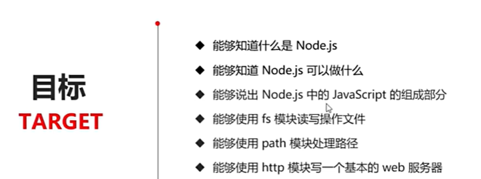

# 1.初识Node.js

## 1.1 回顾与思考

1. 已经掌握了哪些技术

HTML CSS Javascript(添加交互行为)

2. 浏览器中的JavaScript

3. 思考：为什么js可以在浏览器中执行呢

浏览器中加载了一些本质上是**字符串**的待执行js代码，通过**js解析引擎**的存在来解析js代码

4. 思考：为什么js可以操作DOM和BOM

根据内置api来编写js代码 调用webapi  (DOM/BOM/AJAX的api函数可以用于操作对应的对象)

5. 浏览器中的js运行环境

每个浏览器就是一个运行环境

正常运行的条件：**解析引擎 + 内置API函数**

就可以写代码调用api函数然后交给解析引擎

- 内置api是浏览器提供的 只能在浏览器中（所属的运行环境中）被调用

6. js可否做后端开发

常见后端语言：JAVA/PYTHON/PHP语言

> js本身是一门语言，运行环境是浏览器，可做前端开发
>
> node.js是后端的运行环境，js可以在这个运行环境中运行，可以用来做后端开发

## 1.2 Node.js简介

### 1.Node.js简介

Node.js是一个**基于Chrome V8引擎**的JavaScript**运行环境**

- Node.js提供了与浏览器不同的API

- node是一个独立的运行环境 不包含dom/bom/ajax等内置API

> 注意：
>
> ① 浏览器是 JavaScript 的前端运行环境。
>
> ② Node.js 是 JavaScript 的后端运行环境。
>
> ③ Node.js 中**无法调用** DOM 和 BOM 等**浏览器内置 API**。

### 2.nodejs可以做什么

Node.js 作为一个 JavaScript 的运行环境，仅仅提供了基础的功能和 API。然而，基于 Node.js 提供的这些基础能，**很多强大的工具和框架如雨后春笋**，层出不穷，所以学会了 Node.js ，可以让前端程序员胜任更多的工作和岗位：

① 基于 Express 框架（http://www.expressjs.com.cn/），可以快速构建 Web 应用

② 基于 Electron 框架（https://electronjs.org/），可以构建跨平台的桌面应用

③ 基于 restify 框架（http://restify.com/），可以快速构建 API 接口项目

④ 读写和操作数据库、创建实用的命令行工具辅助前端开发、etc…

### 3.node学习路径

浏览器中的 JavaScript 学习路径：

JavaScript 基础语法 + 浏览器**内置 API**（DOM + BOM） + **第三方库**（jQuery、art-template 等）

Node.js 的学习路径：

JavaScript 基础语法 + **Node.js 内置 API 模块**（fs、path、http等）+ **第三方 API 模块**（express、mysql 等）

## 1.3 安装node

教程：[2024最新版Node.js下载安装及环境配置教程【保姆级】_nodejs下载-CSDN博客](https://blog.csdn.net/WHF__/article/details/129362462)

原路径：C:\Users\Rita\AppData\Roaming\npm

# 2.fs 文件系统模块

# 3.path 路径模块

# 4.http模块

