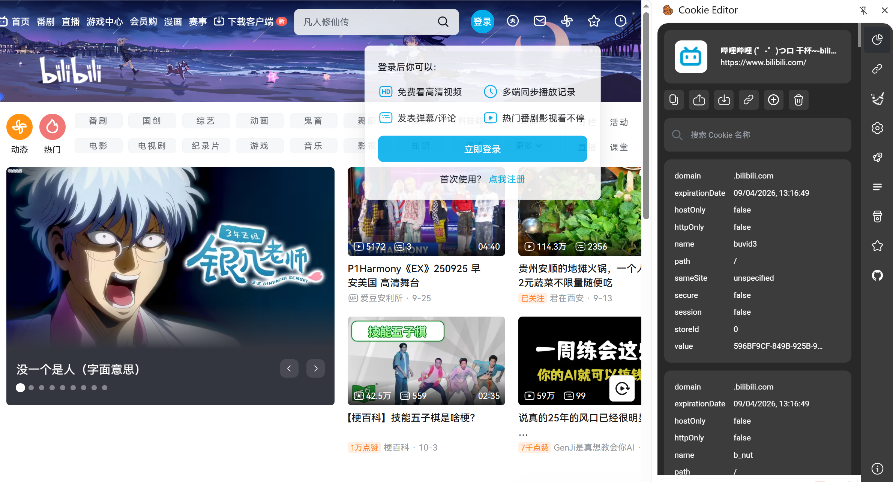

# 1.F12主要标签页探索

### 1.Elements 查看器

**Elements/查看器**

**用途：** 可用于页面结构分析，也可用于**自动化脚本的元素定位**；或者页面元素分析（元素大小，元素布局等）。 前端页面 - html 页面，标签语言。

**1、查看元素的代码**： 点击左上角的箭头图标（或按快捷键 Ctrl+Shift+C）进入选择元素模式，然后从页面中选择需要查看的元素，

然后可以在开发者工具元素（Elements）一栏中**定位到该元素源代码的具体位置**+具体信息。

**2、查看元素的属性：** 定位到元素的源代码之后，可以从源代码中读出该元素的属性。如 class、src、width 等属性的值。

**3、修改元素的代码和属性：** 点击元素，然后右键菜单，可以看到 chrome 提供的对元素进行的操作；选择 Edit as HTML 选项时，元素进入编辑模式，可以对元素的**代码进行任意的修改。** 当然，这个修改也仅对当前的页面渲染生效，**不会修改服务器的源代码**，所以这个功能也是作为**调试页面效果**而使用。

可以对当前页面直接修改属性 双击

### 2.Console 控制台

### 3.Source 源代码/调试器

### 4.Network 网络

> 测试用的非常多 抓包 分析

#### Network网络简介

**用途：**这是测试用的最多的一个模块，主要用于进行测试问题的分析和定位，这个部分**记录了前后端的交互**，是我们学习 F12 工具的重点内容。

前端和后端信息通过接口传输，Network 记录了接口信息（接口封装http协议 -- 定义头部信息）：

http 请求消息：请求行（请求方法）、请求头、请求体 -- 客户端发送

http 响应消息：响应行（响应状态码）、响应头、响应体 -- 服务器回应

#### 报文分析

状态：http 的响应状态码（status：200 正常/404 资源问题/500 503 服务器问题/302 304 重定向……）

方法：http 请求方法 (请求方法 GET POST…)

域名：服务器的域名或者 IP+端口 （主机 服务器）

文件和类型：html、css、js、png （获取的图片类型）

发起者：请求怎么发起的，比如 script：页面是由 script 脚本处理的时候发送的；

传输和大小：传输的文件及大小

详细报文内容：消息头、cookies、请求、响应、耗时

（下部有统计 完成时间）

> 消息头：响应头 请求头
>
> 
>
> 
>
> 

>
>
>
>
>Post的请求 请求体有数据
>
>发送给服务器

有些同学抓不到登录的这个 post 请求：

**保留日志/持续记录：**开启后，重新加载 url，**或者跳转了页面之后**(eg刷新)，之前的请求显示资源信息依然会保留下来，不会清空；

**停用缓存：**开启后，页面资源不会存入缓存，可以在 status 栏的状态码看文件请求状态。

> 停用缓存 不会有那些关于缓存的请求

#### 定位前端/后端报错？

网络没有任何报文 纯前端的提示信息 前后端没有任何交互

有报文 有数据传输 有request/post → 后端报错

(通过看报文/request/post)

**步骤：**

1、明显的前端 js 问题

2、抓包分析：

1. 前端没有发送请求 -- 前端问题
2. 前端发送内容 数据错误 -- 前端问题
3. 后端没有给响应消息 -- 后端问题
4. 后端响应消息，数据错误 -- 后端问题
5. 前端没有正确显示 -- 前端问题

配合数据库数据确认 + Linux 服务器分析项目日志

#### 过滤

**请求过滤：** 

Content type: HTML, CSS, JS XHR 

requests: XMLHttpRequest 

WS: WebSocket 连接

**报文过滤：** --ctrl+L 报文过滤

url: 域名或者文件部分包含这个 URL 

status-code:404 

method:post 

domain:8.129.91.152:8765 

remote-ip:124.237.176.160 

mime-type:image/png 

语法：[https://firefox-source-docs.mozilla.org/devtools-user/network](https://www.google.com/search?q=https://firefox-source-docs.mozilla.org/devtools-user/network)_monitor/request_list/#filtering-by-properties

**搜索请求：**

 1、点击搜索按钮打开搜索框 

2、搜索关键字可以是请求和响应消息头和响应消息体 

3、大小写敏感：Aa 

4、关闭搜索框

### 5.Performance 性能

> 前端页面的性能

### 6.Memory 存储

> cookie 

**用途：**主要存储一些 **cookies** 和**前端数据**等。

#### **本地存储和会话存储** 

主要是前端开发人员**在前端设置**，**一旦数据保存在本地后，就可以避免再向服务器请求数据，因此减少不必要的数据请求**，减少数据在浏览器和服务器间不必要地来回传递。 ——提高浏览器的访问速度

本地存储和会话存储的操作代码完全相同，它们的区别仅仅在于**数据的寿命**。

**本地存储：**保存**不受时间限制**，用于长期保存网站的数据；**除非**用户**自己删除**，否则不会消失；并且**站内任何页面**都可以访问该数据；主要用来保存**访客将来还能看到**的数据。

**会话存储：**用于临时保存针对一个窗口 (或标签页) 的数据，保存受时间限制，**当前窗口一旦关闭**，内容**就会被浏览器删除**。会话存储则用于保存那些需要从一个页面传递给下一个页面的数据。

**案例场景：**比如页面上输入一些内容信息 (注册信息)，中途被打断，页面关闭，然后重新打开，能保留上次输入的内容。

#### Cookies

**Cookies:** 是下载到您计算机上的小文件。比如访问过的链接，单击的按钮，登录信息或过去访问过的页面，当我们**下次访问该网站**时，该网站将使用该信息来**跟踪我们先前在其网站上的活动**。它还可以记住以前输入到表单字段中的信息，例如姓名，日期，出生详细信息，信用卡号等。

> eg.记住了之前输入过的表单信息（活动）

**Cookies 的组成部分：** 

expires = date: 表示 **cookie 的失效时间**，默认是浏览器关闭时失效(可选) -- 会话 默认 

path = 路径: 访问路径，默认为当前文件所在目录(可选)；**设置了之后 只有设置的那个路径文件才可以访问** 

cookies domain = 域名: 访问域名，**限制在该域名下访问(可选) = 设置的域名才可以访问 cookies** 没有设置 默认当前域名 

secure: 安全设置，如果设置了则必须使用 https 协议才可获取 cookie(可选)

完整格式为： **name=value; [expires=date]; [path=路径]; [domain=域名]; [secure]**

cookies 鉴权：用户信息保存在服务器里 ——session（会话——时效）和 session id set cookies字段- 发送给客户端，客户端保存到浏览器(cookies) ——session配套使用。

> session超时cookie也会超时

> 
>
> 

# 2.console

step1.登陆账号

step2.个人空间修改

# 3.cookie

### 什么是Cookie？

**Cookie**（也称为 Web Cookie 或浏览器 Cookie）是服务器发送给用户浏览器并保存在本地的一小块数据。浏览器在下次向同一服务器发起请求时，会携带并发送这些数据到服务器。

**主要作用：**

- **会话状态管理：** 这是 Cookie 最核心的用途。HTTP 协议本身是“无状态”的，而 Cookie 使得服务器能够识别用户的身份，从而维持用户的**登录状态**、记录购物车内容、游戏分数等信息。
- **个性化设置：** 记录用户的偏好设置，如主题、语言、字体大小等。
- **跟踪用户行为：** 记录用户的浏览历史和习惯，用于广告推荐或网站分析。

### 如何查看Cookie？

应用——cookie——域名——列表

### 怎样使用Cookie登入网站(以B站为例)？

只复制关键字段/使用插件直接导出导入cookie貌似都无法实现直接达成登陆状态 应该是b站本身有其他安全机制 有待研究

# 4.其他问题

- 控制台为什么显示报错

  

  >  这条显示的状态码是404 意味着浏览器请求的某资源文件在服务器上未找到

- 如何找到与要修改内容对应的代码

  

- 如何打开开发者工具

  f12/右键检查

- 网络(network)面板里的都是什么？

  见第一部分

- 如何抓包？

  见第一部分

  - 清空原有记录

  - 在network面板开启的情况下 

    eg. 刷新 抓取页面下载过程

    ​	执行操作 抓取特定操作

  - 查看报文信息（请求头 请求体 相应）

  （注意保留日记/停用缓存的功能）

- 端口

  >**80端口**是互联网上最常用的端口之一，它被**超文本传输协议（HTTP）**默认使用。
  >
  >简单来说：
  >
  >1. **用途：** 它是用来提供 **Web 服务**（网页浏览）的标准端口。
  >2. **协议：** 与 **HTTP**（Hypertext Transfer Protocol，超文本传输协议）关联。
  >3. **默认：** 当你在浏览器中输入一个网址（例如 `http://www.example.com`）时，如果你没有明确指定端口号，浏览器会**默认**尝试使用 **80 端口**去连接 Web 服务器。
  >
  >Web 服务器（如 Apache, Nginx 等）通常会监听 80 端口来接收和响应用户的 HTTP 请求，从而向用户发送网页内容。
  >
  >与 80 端口相对的一个重要端口是 **443 端口**，它是用于安全的 Web 服务，即 **HTTPS**（HTTP Secure）协议的默认端口。
