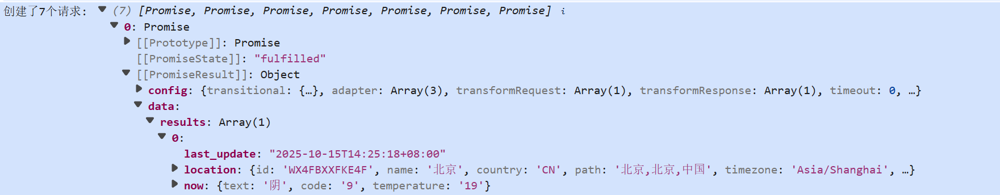
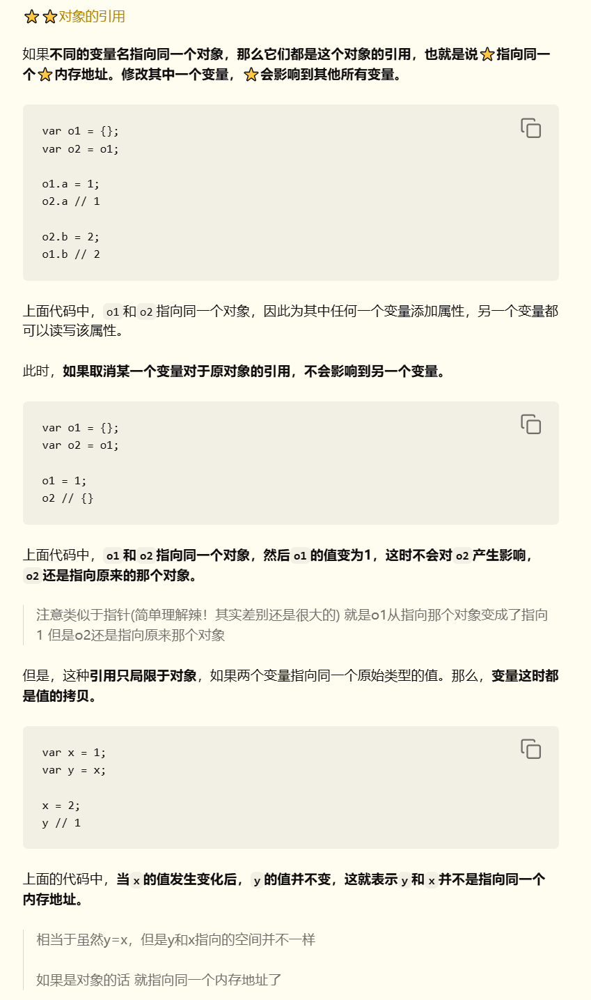

### 1.为什么初始状态为空白？

[具体见代码]

理论上是显示的output这个变量

output是由clscontainer来组成的

而orderStudentGrade没写完 会返回undefined

result = undefined

因为object.keys这个方法只能用于object类型，不能用于undefined

就会出现类型错误 中断代码

### 2.你需要返回一个对象，键是什么？值是什么？

result是一个对象，键是班级编号(1/2/3)，值是该班级的学生数组

（具体见代码注释）

### 3.其他问题

##### 1. **你需要初步了解JS的：**

- **作用域**

  - 全局作用域/函数作用域/块级作用域

  - var/let/const

    > 1. 关于let/const 和 var的区别
    >
    > 1）var为函数作用域，let/const为块级作用域
    >
    > 2) 变量提升(提升到全局作用域顶部)：
    >
    > ​     var/let/const其实都有 但let/const在声明前访问会触发报错
    >
    > ​     → 一般还是用let/const
    >
    > 2. let和const
    >
    >    var/let允许重新赋值 const不允许
    >
    >    而且const必须在声明时赋值

- **闭包**

  - 函数能够记住被创建时所在的作用域，即使函数在被创建的词法作用域外执行
  - 一个内部函数被返回到其外部作用域之外时，**它依然保持对外部函数中变量的访问权限。** → 可以记住信息

- **原型链**

  - js的**对象继承**是由原型链实现的

  - 概念：

    > 1. **原型 (Prototype)**：每个 JavaScript **对象**都有一个内部属性 `[[Prototype]]`（在代码中通过 `__proto__` 访问），指向另一个对象，这个被指向的对象就是它的**原型**。
    > 2. **构造函数 (Constructor)**：每个**函数**都有一个 `prototype` 属性，它指向一个对象，这个对象就是通过该函数创建的实例的原型。

  - 链式查找：

    试图访问属性时：自身查找 → 沿对象的__proto__指针去原型找 → 一层层查找 → 最终到Object.prototype → 没找到则返回undefined

- **异步编程**

  - js是单线程的，使用异步编程来避免耗时操作阻塞主线程

  - 核心：异步任务开始时，会交给浏览器/node.js处理，主线程继续执行，等异步任务完成，回调函数才会被放入事件队列

  - 常见方式

    1. 回调函数

       eg.定时器：`setTimeout()`和`setInterval()`

    2. promise对象

       > 起到代理作用（proxy），充当异步操作与回调函数之间的中介，使得异步操作具备同步操作的接口。Promise 可以让异步操作写起来，**就像在写同步操作的流程，而不必一层层地嵌套回调函数。**

       - 执行完异步操作返回了一个promise对象，(也相当于一个等位牌，不管是失败还是成功一定有一个结果)可以作为一个占位符，可以链式调用.then()和.catch()来处理未来的异步操作结果

       - promise的属性

         

       - promise三种状态

##### 2. **还需要进一步学习ES6/ES7的特性，比如：**

- **变量声明的变化**

  - 见作用域 var/let/const

- **某些数据结构（什么是对象？）**

  - 对象：存储键值对

    > 特点：
    >
    > ①可以动态增删改查 动态可变性高
    >
    > ②引用类型：变量赋值时其实是赋的地址
    >
    > > 例子：
    > >
    > > 
    >
    > ③属性/方法(对象为函数时)
    >
    > > eg 对象的特有函数

- **箭头函数**

  - （参数1，参数2）=> { 函数体 }

    > 若函数体只有一行return语句 可以改成（参数1，参数2）=> 返回值

  - 箭头函数中的this

    > 传统函数：this是动态的，常因指向问题在异步回调中导致问题
    >
    > 箭头函数：在定义时就从父级作用域（外层作用域）继承 this 的值，并且一旦绑定永不改变

- **模板字符串**

  - `${}`：嵌入变量

  - ` ··` （是说反引号）：允许在字符串中嵌入用`包裹的表达式

  - 多行字符串无需换行

    > ```javascript
    > const html = `
    >     <div>
    >         <h1>User Profile</h1>
    >         <p>Name: ${name}</p>
    >     </div>
    > `;
    > ```

- **解构赋值**

  - 允许从数组或对象中提取值，并将它们赋值给新的变量

  - ⭐可以直接从数组和对象中获得值 很好用

    1. 对象解构

       ```JavaScript
       const user = { firstName: 'Diana', lastName: 'Prince', country: 'Themyscira' };
       
       // 从 user 对象中提取 firstName 和 country 属性
       const { firstName, country } = user;
       
       console.log(firstName); // Diana
       console.log(country);   // Themyscira
       
       // 重命名变量
       const { firstName: givenName } = user;
       console.log(givenName); // Diana
       ```

    2. 数组解构

       ```JavaScript
       const colors = ['Red', 'Green', 'Blue'];
       
       // 提取数组中的前两个元素
       const [c1, c2] = colors;
       
       console.log(c1); // Red
       console.log(c2); // Green
       
       // 跳过元素
       const [ , , c3] = colors; // 跳过前两个，只取第三个
       console.log(c3); // Blue
       ```

- **模块化开发（了解）**

  - 每个文件都被视为一个独立的模块
  - 模块内部的**变量和函数**默认都是**私有**的
  - 只有通过明确的 **export 和 import 语句**才能在**模块之间共享**。

**3. 进阶：DOM和BOM操作方法**

- DOM树 
- CSS树 
- 事件队列 + 异步操作 

