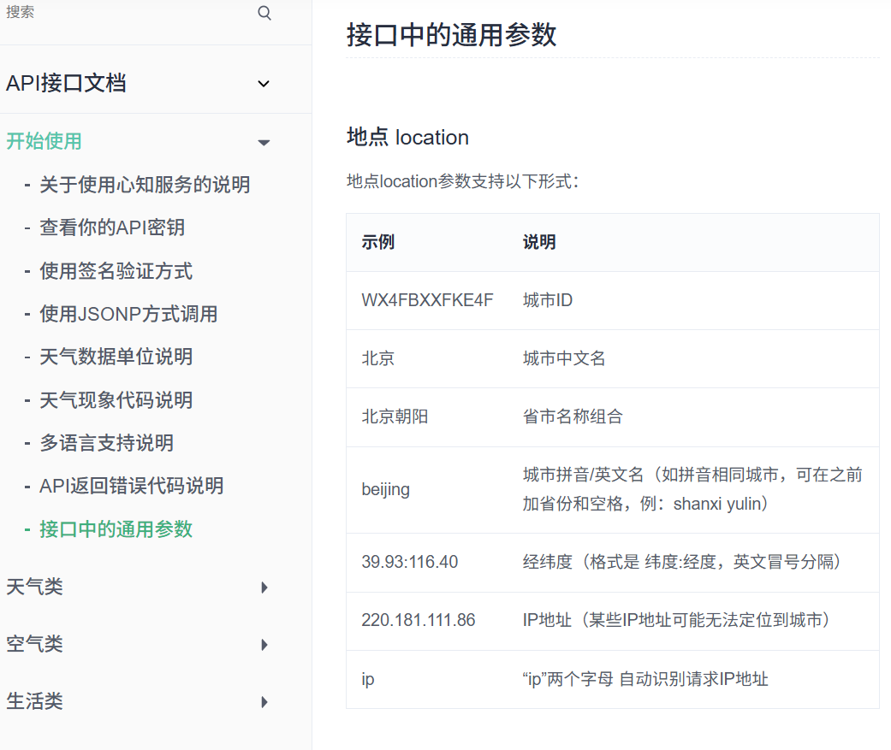

### 1.研究url

https://api.seniverse.com/v3/weather/now.json?key=SWJEEWD_M17tT3zGk&location=城市名

- `api.seniverse.com` 主机/域名 心知天气服务的地址

- `/v3/weather/now.json` 路径 API 资源路径

  > v3：api版本
  >
  > weather：天气数据资源
  >
  > now.json:①实时天气②数据返回格式为json

- ？是分隔符    分割url路径和查询参数           &是连接参数的连接符

- `key=SWJEEWD_M17tT3zGk` 查询参数——API密钥 验证身份和权限

- `location=城市名` 查询参数——查询条件 位置参数

→向`api.seniverse.com` 发送GET请求，使用城市名查询v3版本的实时天气数据，返回json数据

官网文档：[接口中的通用参数 | 心知天气文档](https://docs.seniverse.com/api/start/common.html)

### 2.思路

先搭建html结构

js部分：

1. 定义变量和常量

   定义城市和用来存储天气数据的数组
   
2. 获取页面元素供js操作
   
3. 发送请求

   step1.为每个城市创建一个api请求

   > 1. axios({ url: '...' }) 会立即返回一个 Promise 对象，代表这个请求的未来结果。
   >
   > 2. promise：
   >
   >    - Promise 对象是 JavaScript 的异步操作解决方案，为异步操作提供统一接口。它起到代理作用（proxy），充当异步操作与回调函数之间的中介，使得异步操作具备同步操作的接口。Promise 可以让异步操作写起来，就像在写同步操作的流程，而不必一层层地嵌套回调函数。
   >
   >    - Promise 的设计思想是，**所有异步任务都返回一个 Promise 实例**。Promise 实例有一个`then`方法，用来指定下一步的回调函数。
   >
   >    - 只有三种状态：Promise 对象通过自身的状态，来控制异步操作。Promise 实例具有三种状态。
   >
   >      - 异步操作未完成（pending）
   >      - 异步操作成功（fulfilled）
   >      - 异步操作失败（rejected）
   >
   >    - 
   >
   >    - 
   >
   >      此时状态已经是fulfilled 已得到所有请求的成功结果
   >
   >    - axios() 函数执行后，它不会立即返回天气数据，因为它需要时间去访问网络。相反，它会**立即返回一个 Promise 对象**。
   >
   >      所以requests 这个变量变成了一个包含 7 个 Promise 对象的数组

   step2 使用promise.all等待所有请求正常完成

   > 1. promise.all(request)接收的是元素为promise的数组
   >
   >    > 接收一个 Promise 数组（此处requests），然后返回一个新的、单一的 Promise
   >
   > 2. 打印响应数据便于分析

   step3. 处理返回的数据

- 其他关于计算机网络的问题详见**fronted_learning\NOTE\NOTE\HTTP开发者工具**