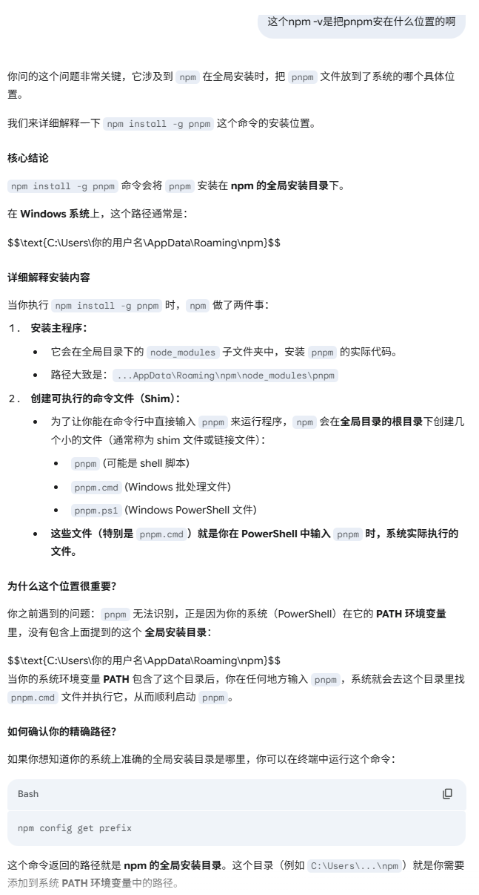
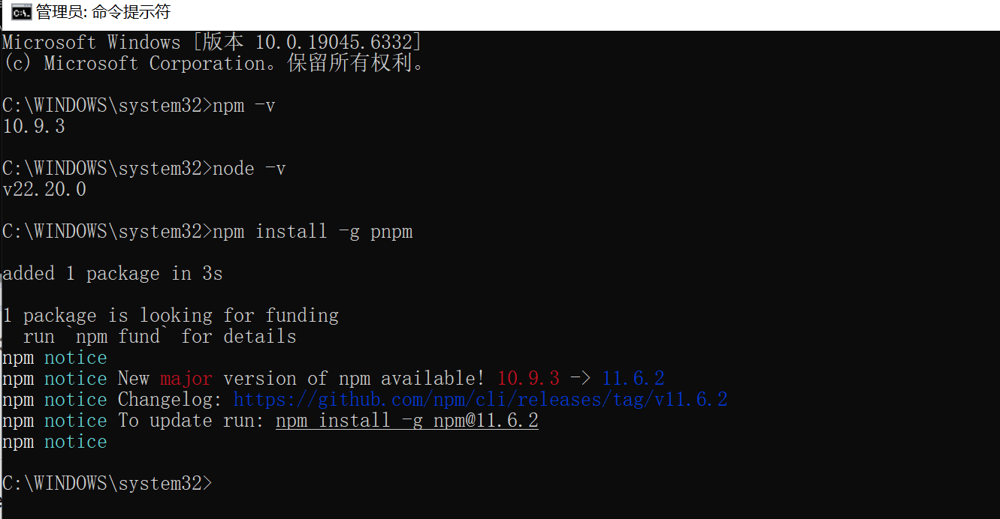
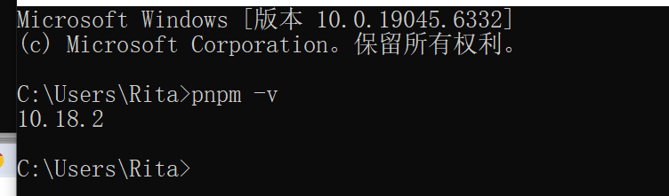
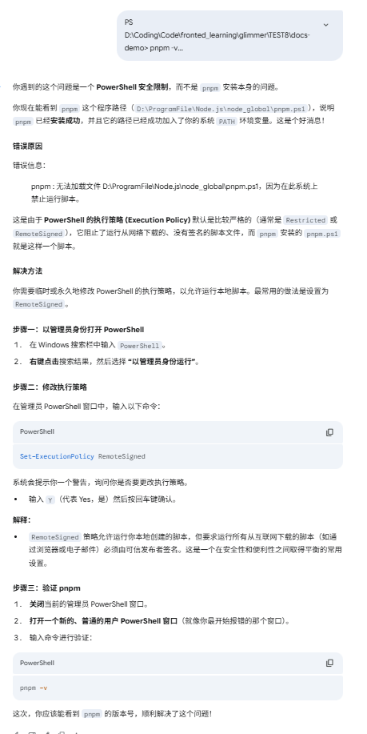
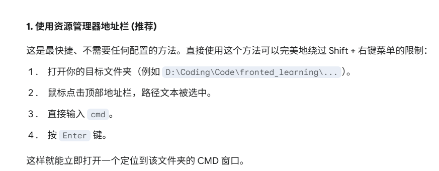

shift+右键cmd

注意要用管理员权限

Microsoft Windows [版本 10.0.19045.6332]
(c) Microsoft Corporation。保留所有权利。

D:\Coding\Code\fronted_learning\glimmer\TEST8\docs-demo>npm -v
10.9.3

D:\Coding\Code\fronted_learning\glimmer\TEST8\docs-demo>pnpm -v
10.18.2

D:\Coding\Code\fronted_learning\glimmer\TEST8\docs-demo>node -v
v22.20.0

D:\Coding\Code\fronted_learning\glimmer\TEST8\docs-demo>pnpm add -D vitepress
Packages: +127
++++++++++++++++++++++++++++++++++++++++++++++++++++++++++++++++++++++++++++++++++++++++++++++++++++++++++++++++++++++
Progress: resolved 170, reused 0, downloaded 127, added 127, done

devDependencies:
+ vitepress 1.6.4

╭ Warning ───────────────────────────────────────────────────────────────────────────────────╮
│                                                                                            │
│   Ignored build scripts: esbuild.                                                          │
│   Run "pnpm approve-builds" to pick which dependencies should be allowed to run scripts.   │
│                                                                                            │
╰────────────────────────────────────────────────────────────────────────────────────────────╯

Done in 9.2s using pnpm v10.18.2

D:\Coding\Code\fronted_learning\glimmer\TEST8\docs-demo>pnpm vitepress init

T  Welcome to VitePress!
|
o  Where should VitePress initialize the config?
|  ./
|
o  Site title:
|  My Awesome Project
|
o  Site description:
|  A VitePress Site
|
o  Theme:
|  Default Theme + Customization
|
o  Use TypeScript for config and theme files?
|  No
|
o  Add VitePress npm scripts to package.json?
|  Yes
|
—  Done! Now run pnpm run docs:dev and start writing.

Tips:
- Since you've chosen to customize the theme, you should also explicitly install vue as a dev dependency.

D:\Coding\Code\fronted_learning\glimmer\TEST8\docs-demo>